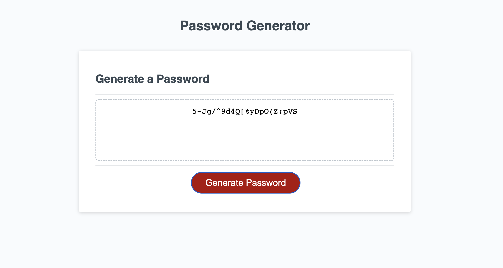

# Password-Generator

An application that can generate a random password based on the criteria that has been selected by the user.

## Description

The aim of this project was to create an application that can generate a password based on the character types and length that the user selects. The password generator was made using JavaScript, and the webpage was designed and structured using HTML and CSS.

## Usage

Four seperate arrays stored different character types (uppercase and lowercase letters, special characters and numbers.) Upon clicking the "generate password" button, the user is prompted on the number of characters they want their password to be. They can then choose the types of characters they wish to incorporate into the password. Based on the selected character arrays, the characters are then randomly generated to form a password.

## License

Password-Generator is licensed under the MIT license.

## Installation

To use the password generator click the link to the deployed webpage, then select "generate password." The user should then follow the prompts by enterting a password length, then by selecting the character types by clicking "OK." To decline specific character types the user should select "cancel." Alternately, you can view the application by opening the files in a text editor program (such as VisualStudio,) or by viewing the console in the Google Chrome browser by selecting "inspect" and "console."

## Deployed webpage link
